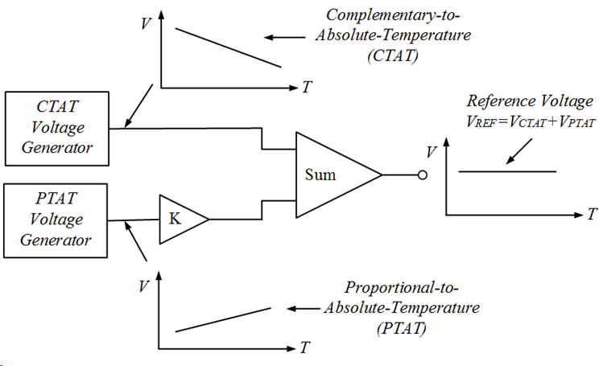
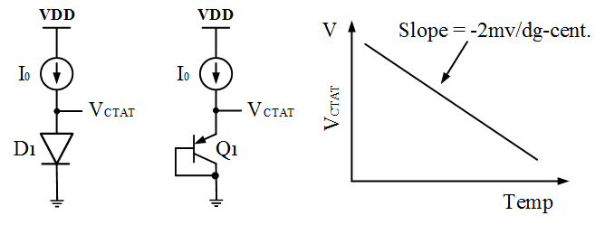
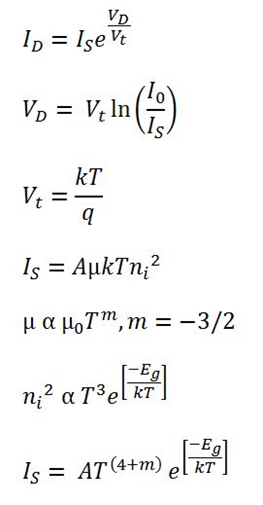
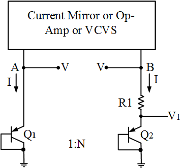
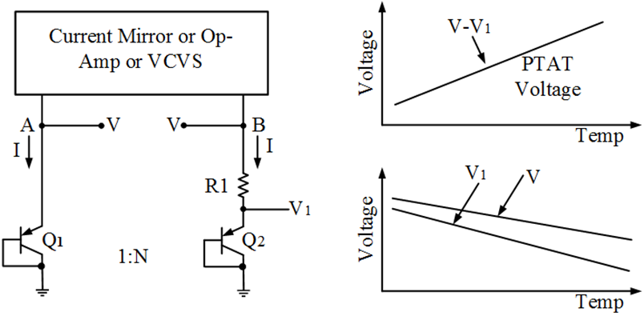
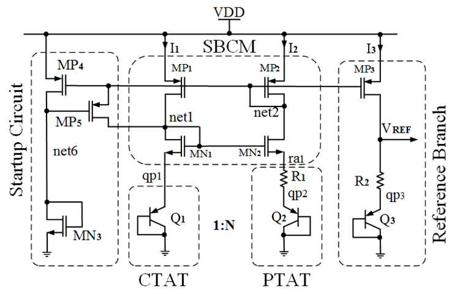
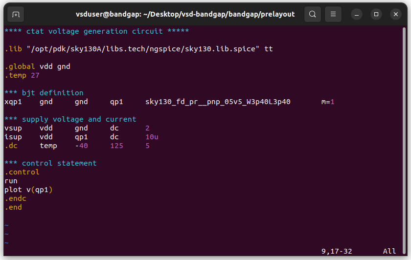
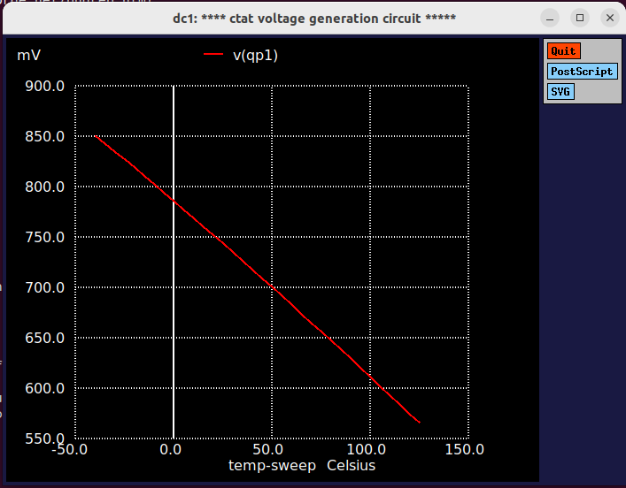

# Project Title: Design of a Bandgap Reference Circuit

## 1. Introduction
This project involves the design and implementation of a Curvature-Compensated Bandgap Reference (BGR) circuit using the Sky130 (130nm) Process Design Kit. The primary objective is to generate a stable reference voltage ($V_{ref}$) that remains independent of supply voltage variations (Power Supply Rejection) and temperature fluctuations. By combining a PTAT (Proportional to Absolute Temperature) current and a CTAT (Complementary to Absolute Temperature) voltage, the circuit achieves a near-zero temperature coefficient, making it an essential building block for analog and mixed-signal systems like ADCs and LDOs.

---

## 2. Circuit Design and Implementation
In this section, I have broken down the BGR into its sub-blocks:

### 2.1 BGR Principle
The operation principle of BGR circuits is to sum a voltage with negative temprature coefficient with another one exhibiting opposite temperature dependancies. Generally semiconductor diode behave as CTAT i.e. Complement to absolute temp. which means with increase in temp. the voltage across the diode will decrease. So we need to find a PTAT circuit which can cancel out the CTAT nature i.e. with rise in temp. the voltage across that device will increase and thus we can get a constant voltage reference with respect to temp.

  
  

### 2.2 CTAT (Complementary to Absolute Temperature)
The CTAT voltage is generated by a forward-biased diode ($D_1$) or a diode-connected BJT ($Q_1$) driven by a constant current source. The output voltage, $V_{CTAT}$, is equivalent to the base-emitter voltage ($V_{BE}$) of the transistor. Due to the intrinsic properties of silicon, $V_{BE}$ exhibits a negative temperature coefficient, meaning the voltage decreases as the temperature rises. As shown in the graph, this relationship is nearly linear with a characteristic slope of approximately $-2 \, mV/^\circ C$. In the final BGR circuit, this decreasing voltage is summed with a PTAT voltage to achieve temperature independence. 

  

### 2.3 PTAT (Proportional to Absolute Temperature)
  

From Diode current equation we can find that it has two parts, i.e.
*Vt (Thermal Voltage) which is directly proportional to the temp. (order ~ 1)
*Is (Reverse saturation current) which is directly proportional to the temp. (order ~ 2.5), as this Is term is in denominator so with increase in temp. the ln(Io/Is) decreases which is responsible for CTAT nature of the diode.

So to get a PTAT Voltage generation circuit we have to find some way such that we can get the Vt separated from Is.

To get Vt separated from Is we can approach in the following way

  

In the above circuit same amount of current I is flowing in both the branches. So the node voltage A and B are going to be same V. Now in the B branch if we substract V1 from V, we get Vt independent of Is.

  
  
  V = Combined Voltage across R1 and Q2 (CTAT in nature but less sloppy)  
  V1 = Voltage across Q2 (CTAT in nature but more sloppy)  
  V-V1 = Voltage across R1 (PTAT in nature)  

From above we can see that the voltage V-V1 is PTAT in nature, but it's slope is very less as compared to the CTAT, so we have to increase the slope. In order to increase the slope we can use multiple BJTs as diode, so that current per individual diode will be less and it the slope of V-V1 will increase.  

  


### Types of BGR
Architecture wise BGR can be designed in two ways    
  1. Using Self-biased current mirror  
  2. Using Operational-amplifier  

Application wise BGR can be categorized as  
  1. Low-voltage BGR  
  2. Low-power BGR  
  3. High-PSRR and low-noise BGR  
  4. Curvature compensated BGR  
  
We are going to design our BGR circuit using Self-biased current mirror architecture.


### 2.4 Self-Biased Current Mirror
The Self-biased current mirror is a type of current mirror which requires no external biasing. This current mirrors biases it self to the desired current value without any external current source reference.
  
  

### 2.5 Reference Voltage Branch
The reference circuit branch performs the addition of CTAT and PTAT volages and gives the final reference voltage. We are using a mirror transitor and a BJT as diode in the reference branch. By virtue of the mirror transistor in the reference branch the same amount of current flows through it as of the current mirror branches. Now from the PTAT circuit branch we are getting PTAT voltage and PTAT current. The same PTAT current is flowing in the reference branch. But the slope of PTAT voltage is much more smaller than that of slope of CTAT voltgae. In order to make increase the voltage slope we have to increase the resistance (current constant, so V increases with increase in R). Now across the high resistance we will get our constant reference voltage which is the result of CTAT Voltage + PTAT Voltage.  

  

### 2.6 Startup Circuit
The start-up circuit is required to move out the self biased current mirror from degenerative bias point (zero current). The start-up circuit forecefully flows a slow amount of current through the self-biased current mirror when the current is 0 in the current mirror branches, as the current mirror is self biased this small current creats a disturbance and the current mirror auto biased to the desired current value.  

  

### 2.7 Full Integrated Circuit
Now by connecting all above components we can get the complete BGR circuit.  

  

### Advantages of SBCM BGR:
  Simplest topology  
  Easy to design  
  Always stable  
  
### Limitations of SBCM BGR:
  Low power supply rejection ratio (PSRR)  
  Cacode design needed to reduce PSRR  
  Voltage head-room issue  
  Need start-up circuit  

---

## 3. Simulations and Results
For the practical implementation of the Bandgap Reference (BGR) circuit, the **SkyWater SKY130 (130 nm)** PDK is used.  
Before designing the complete circuit, we must first define the **design requirements** that our circuit should meet.

---

### 3.1 Design Requirements

| Parameter | Specification |
|------------|----------------|
| Supply Voltage (VDD) | 1.8 V |
| Temperature Range | -40°C to 125°C |
| Power Consumption | < 60 µW |
| Off Current | < 2 µA |
| Start-up Time | < 2 µs |
| Temperature Coefficient (Tempco) of Vref | < 50 ppm/°C |

---

### 3.2 Device Data Sheet

#### 1. MOSFET

| Parameter | NFET | PFET |
|------------|-------|-------|
| Type | LVT | LVT |
| Voltage Rating | 1.8 V | 1.8 V |
| Threshold Voltage (Vt0) | ~0.4 V | ~-0.6 V |
| Model | sky130_fd_pr__nfet_01v8_lvt | sky130_fd_pr__pfet_01v8_lvt |

---

#### 2. Bipolar Junction Transistor (PNP)

| Parameter | PNP |
|------------|------|
| Current Rating | 1 µA – 10 µA/µm² |
| Beta (β) | ~12 |
| Area | 11.56 µm² |
| Model | sky130_fd_pr__pnp_05v5_W3p40L3p40 |

---

#### 3. Resistor (RPOLYH)

| Parameter | RPOLYH |
|------------|----------|
| Sheet Resistance | ~350 Ω/sq |
| Tempco | 2.5 Ω/°C |
| Available Widths | 0.35 µm, 0.69 µm, 1.41 µm, 5.37 µm |
| Model | sky130_fd_pr__res_high_po |

---

### 3.3 Circuit Design

#### 1. Current Calculation

Maximum Power Consumption = 60 µW  
Supply Voltage = 1.8 V  

Total Current = 60 µW / 1.8 V = 33.33 µA  

Hence, 10 µA per branch is selected (3 × 10 = 30 µA)  
Start-up current = 1–2 µA  


#### 2. Choosing Number of BJTs in Branch 2

- Fewer BJTs → smaller resistance but poorer matching  
- More BJTs → higher resistance but better matching  

Chosen compromise: **8 BJTs** in parallel for good matching and moderate resistance.


#### 3. Calculation of R1

R1 = (Vt × ln(8)) / I  
R1 = (26 mV × ln(8)) / 10.7 µA ≈ 5 kΩ  

R1 Size:  
- W = 1.41 µm  
- L = 7.8 µm  
- Unit resistance = 2 kΩ  

Resistor implementation: 2 in series and 2 in parallel (2 + 2 + (2‖2))


#### 4. Calculation of R2

Current through reference branch:  
I3 = I2 = (Vt × ln(8)) / R1  

Voltage across R2:  
VR2 = R2 × I3 = (R2 / R1) × (Vt × ln(8))  

Slope of VR2 = (R2 / R1) × (ln(8) × 115 µV/°C)  
Slope of VQ3 = -1.6 mV/°C  

For zero temperature coefficient,  
Total slope = 0 → R2 ≈ 33 kΩ  

Resistor implementation: 16 in series and 2 in parallel (2 + 2 + … + 2 + (2‖2))


#### 5. Self-Biased Current Mirror (SBCM) Design

##### A. PMOS Design (MP1, MP2)

- Operate both transistors in saturation region.  
- Increase channel length to reduce channel length modulation.  
- Final size: L = 2 µm, W = 5 µm, M = 4  

##### B. NMOS Design (MN1, MN2)

- Operate both transistors either in saturation or deep subthreshold region.  
- Here, they are designed to work in deep subthreshold region.  
- Increase channel length to improve stability.  
- Final size: L = 1 µm, W = 5 µm, M = 8  
  
### Final Circuit


---

### 3.4 Writing spice netlist and Pre-layout simulation
#### Steps to write netlist  
1. Create a file with `.sp` extension, open with any editor like `gvim` / `vim` / `nano`.
2. The 1st line of the Spice netlist is by default a comment line.
3. To write a valid netlist we must include the library file (with absolute path) and mention the corner name (tt, ff or ss).



## Netlist Explanation 

### 1️. Global and Temperature Setup
- `.global vdd gnd` → Declares **VDD** and **GND** as global nodes, accessible throughout the design.  
- `.temp 27` → Sets the **simulation temperature** to **27°C (room temperature)**.

---

### 2️. Voltage-Controlled Voltage Source (VCVS)
```spice
*** vcvs definition
e1 ra1 qp1 net2 gnd gain=1000
````
e1 defines a VCVS (Voltage-Controlled Voltage Source).

Input nodes: qp1 and net2

Output nodes: ra1 and gnd

gain=1000 → Output voltage = 1000 × (V(qp1) - V(net2))

Used for amplification or feedback control in analog reference circuits.
### 3️. MOSFET Definition (PMOS Devices)
```spice
*** mosfet definition
xmp1 q1 net2 vdd vdd sky130_fd_pr__pfet_01v8_lvt l=2 w=5 m=4
xmp2 q2 net2 vdd vdd sky130_fd_pr__pfet_01v8_lvt l=2 w=5 m=4
```
xmp1, xmp2 are PMOS transistors used in bias or mirror configurations.

Model: sky130_fd_pr__pfet_01v8_lvt → 1.8V Low-Threshold PMOS (from Sky130 PDK).

Node order: Drain → Gate → Source → Bulk

Parameters:

l=2 → Channel Length = 2µm

w=5 → Channel Width = 5µm

m=4 → 4 parallel transistors for higher drive strength and better matching.

Both transistors share the same gate (net2) to form a current mirror or load pair.

### 4️. Resistor Definition
```spice
**resistor definition
xra ra1 qp2 gnd sky130_fd_pr__res_high_po_1p41 l=30
```
xra defines a high-poly resistor using Sky130 PDK.

Model: sky130_fd_pr__res_high_po_1p41 → High-Resistivity Polysilicon Resistor.

Nodes: Between ra1 and qp2, connected to gnd.

Parameter: l=30 → Resistor length = 30µm (resistance ∝ length).

Used to generate voltage drops or temperature-dependent resistances in the circuit.

 ### 5️. BJT (PNP Transistor) Definition
```spice
**bjt definition
xqp1 gnd gnd qp1 gnd sky130_fd_pr__pnp_05v5_w3p40l3p40 m=1
xqp2 gnd gnd qp2 gnd sky130_fd_pr__pnp_05v5_w3p40l3p40 m=8
```
xqp1, xqp2 are PNP BJTs used for CTAT and PTAT voltage generation.

Model: sky130_fd_pr__pnp_05v5_w3p40l3p40 → 5V PNP transistor from SkyWater PDK.

Node order: Collector → Base → Emitter → Substrate

Parameters:

m=1 → Single transistor (for base reference branch).

m=8 → 8 parallel BJTs (used to adjust emitter area and current density).

Increasing m improves matching and modifies Vbe slope for temperature compensation.


### 3.4.1 CTAT Simulation 
#### Simulation Command  
Open your terminal and navigate to the **prelayout** directory.  
Run the following command to launch the simulation:

```bash
cd /workspaces/vsd-bandgap/bandgap/prelayout/
ngspice ctat_voltage_gen.sp
```
After simulation we can get a wavefrom like below, and from the wavefrom we can see the CTAT behaviour of the BJT  

